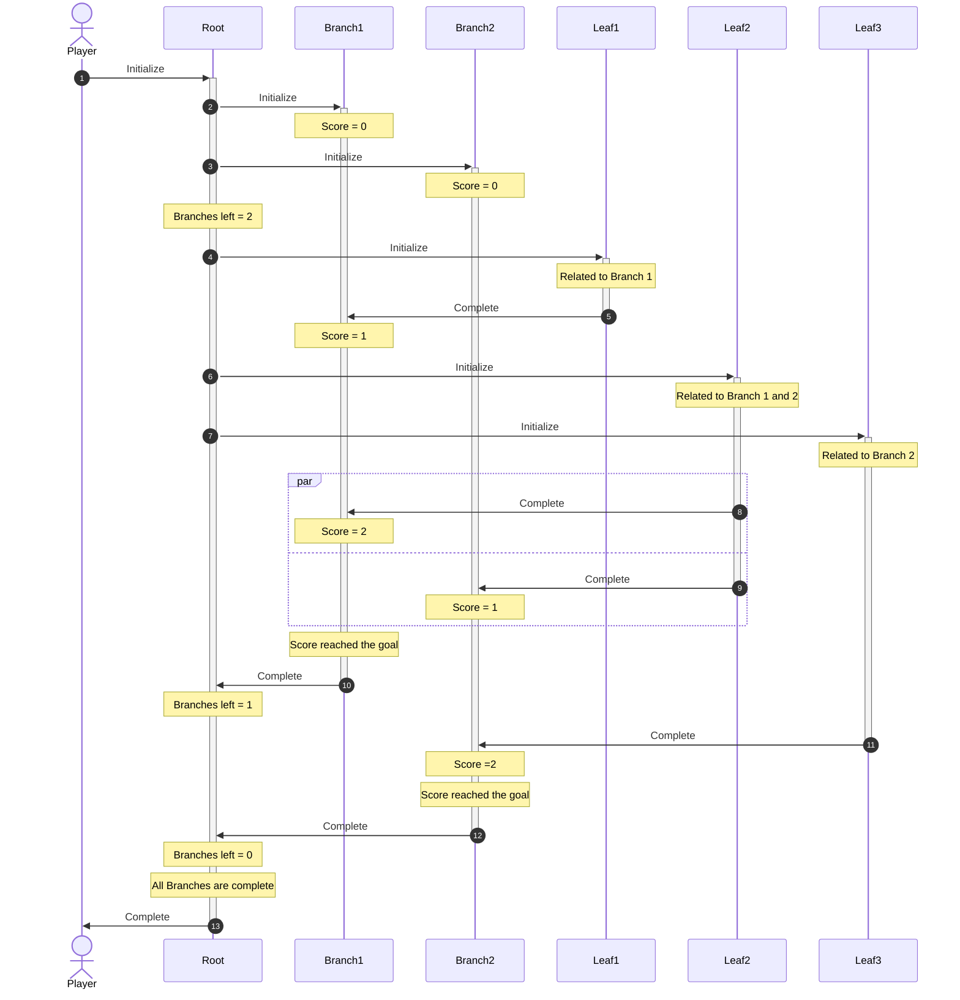

# Story - Grand Tomorrow

## Structure

```mermaid
sequenceDiagram
    autonumber
    actor Player

    Player->>+Root: Initialize
    Root->>+Branch1: Initialize
    Note over Branch1: Score = 0
    Root->>+Branch2: Initialize
    Note over Branch2: Score = 0
    Note over Root: Branches left = 2
    Root->>+Leaf1: Initialize
    Note over Leaf1: Related to Branch 1
    Leaf1->>-Branch1: Complete
    Note over Branch1: Score = 1
    Root->>+Leaf2: Initialize
    Note over Leaf2: Related to Branch 1 and 2
    Root->>+Leaf3: Initialize
    Note over Leaf3: Related to Branch 2
    par
        Leaf2->>Branch1: Complete
        Note over Branch1: Score = 2
    and
        Leaf2->>-Branch2: Complete
        Note over Branch2: Score = 1
    end
    Note over Branch1: Score reached the goal
    Branch1->>-Root: Complete
    Note over Root: Branches left = 1
    Leaf3->>-Branch2: Complete
    Note over Branch2: Score =2
    Note over Branch2: Score reached the goal
    Branch2->>-Root: Complete
    Note over Root: Branches left = 0
    Note over Root: All Branches are complete
    Root->>-Player: Complete
```
