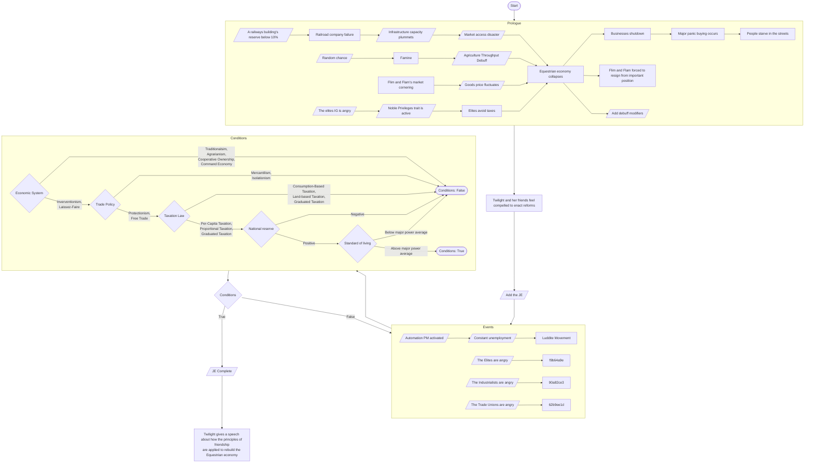

```mermaid
%%{
    init: {
        "flowchart": {
            "curve": "linear"
        }
    }
}%%

flowchart TD
    8b9556f5([Start])

    subgraph "Prologue"
        fe14b3b9[/A railways building's reserve below 10%/]
        39ef71e5[Railroad company failure]
        3eccb587[/Infrastructure capacity plummets/]
        72bbaae4[/Market access disaster/]
        dd78f27b[/Random chance/]
        c2fb29e7[Famine]
        5ee8de16[/Agriculture Throughput Debuff/]
        2cedcc0f[Flim and Flam's market cornering]
        d0eb77b5[Flim and Flam forced to resign from important position]
        69f7d645[/Goods price fluctuates/]
        ddca7d1d[/The elites IG is angry/]
        cbbb6667[/Noble Privileges trait is active/]
        04e6d51e[Elites avoid taxes]
        5c2609e8[Equestrian economy collapses]
        fdebfa67[Major panic buying occurs]
        d901b554[Businesses shutdown]
        a6dd78b9[People starve in the streets]
        51829c50[/Add debuff modifiers/]

        fe14b3b9 --> 39ef71e5 --> 3eccb587 --> 72bbaae4 --> 5c2609e8
        dd78f27b --> c2fb29e7 --> 5ee8de16 --> 5c2609e8
        2cedcc0f --> 69f7d645 --> 5c2609e8
        ddca7d1d --> cbbb6667 --> 04e6d51e --> 5c2609e8
        5c2609e8 --> d901b554 --> fdebfa67 --> a6dd78b9
        5c2609e8 --> d0eb77b5
        5c2609e8 --> 51829c50
    end

    8b9556f5 --> Prologue

    a6af1fd7[Twilight and her friends feel compelled to enact reforms]
    9efc5ea6[/Add the JE/]

    Prologue --> a6af1fd7 --> 9efc5ea6

    subgraph "Events"
        b58b348e[/Automation PM activated/]
        b1c5bb13[/Constant unemployment/]
        768fd509[Luddite Movement]
        3ffddfad[/The Elites are angry/]
        f9b64a9e
        8c6e9f33[/The Industrialists are angry/]
        90a82ce3
        17edcfbb[/The Trade Unions are angry/]
        62b9ee1d

        b58b348e --> b1c5bb13 --> 768fd509
        3ffddfad --> f9b64a9e
        8c6e9f33 --> 90a82ce3
        17edcfbb --> 62b9ee1d
    end

    subgraph "Conditions"
        fff415ba{Economic System}
        a1b8b19e{Trade Policy}
        8ebace6f{Taxation Law}
        bea5a2ce{National reserve}
        fc1a99db{Standard of living}
        b1995adf([Conditions: False])
        65513139([Conditions: True])

        fff415ba -- Traditionalsim,<br>Agrarianism,<br>Cooperative Ownership,<br>Command Economy --> b1995adf
        fff415ba -- Inverventionism,<br>Laissez-Faire --> a1b8b19e
        a1b8b19e -- Mercantilism,<br>Isolationism --> b1995adf
        a1b8b19e -- Protectionism,<br>Free Trade --> 8ebace6f
        8ebace6f -- Consumption-Based Taxation,<br>Land-based Taxation,<br>Graduated Taxation --> b1995adf
        8ebace6f -- Per-Capita Taxation,<br>Proportional Taxation,<br>Graduated Taxation --> bea5a2ce
        bea5a2ce -- Negative --> b1995adf
        bea5a2ce -- Positive --> fc1a99db
        fc1a99db -- Below major power average --> b1995adf
        fc1a99db -- Above major power average --> 65513139
    end

    dafec78a{Conditions}
    95962cd8[/JE Complete/]
    4dc9bf3a[Twilight gives a speech about how the principles of friendship<br>are applied to rebuild the Equestrian economy]

    9efc5ea6 --> Events --> Conditions --> dafec78a
    dafec78a -- False --> Events
    dafec78a -- True --> 95962cd8 --> 4dc9bf3a
```
